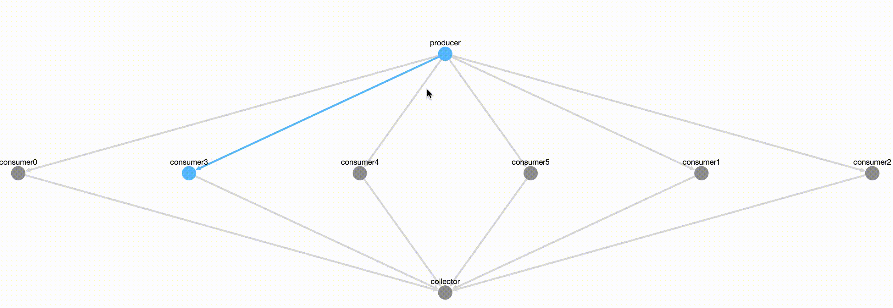

# Kotlin Fan In / Fan Out Animated

This is a project demonstrating what Fan In and Fan Out design patterns look in practice.  <br />
Originally created for my AmsterdamJUG talk<br />
Project uses Ktor as a server and CytoscapeJS to render the graph

## Installation
```
./gradlew run
```

## What it looks like:



## License
MIT